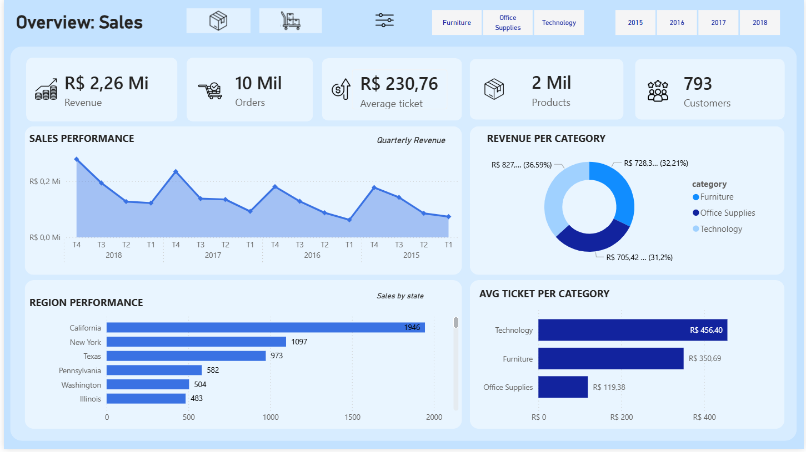
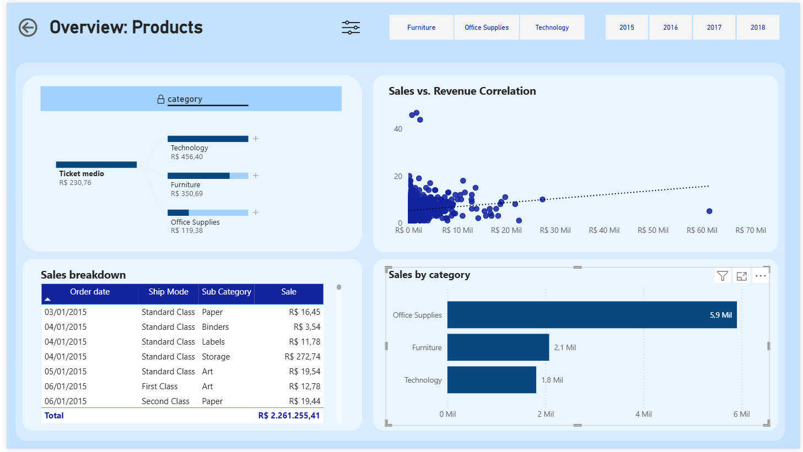
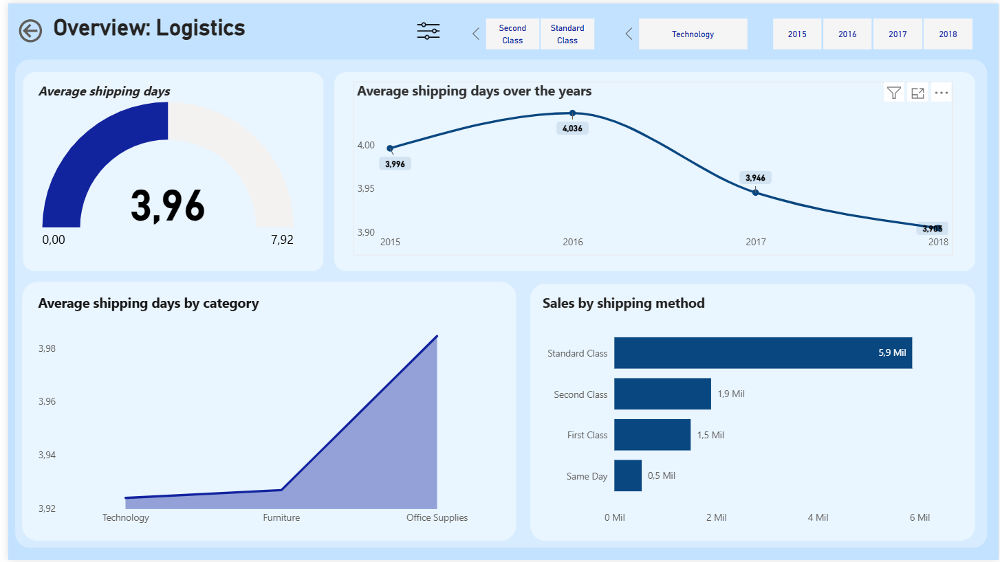
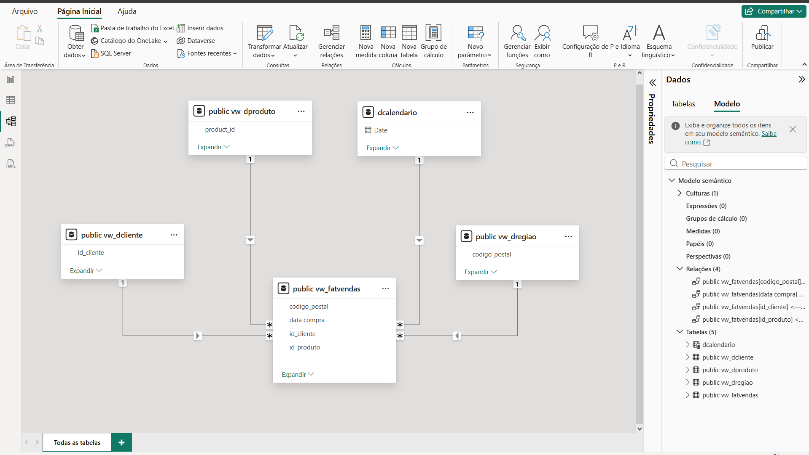

# Superstore Analytics
Este projeto consiste no desenvolvimento de um pipeline de dados completo, desde a ingestão e tratamento em um banco de dados relacional até a criação de um dashboard estratégico focado em logística e performance de produtos.

# Stack Tecnológica
- Engine de Dados: PostgreSQL (Ingestão e Tratamento)
- Modelagem: Star Schema (Dimensões e Fato)

- Visualização: Power BI
- Linguagem: SQL (CTEs, Window Functions, DDL/DML) e DAX(SUM, COUNT, AVERAGE, DIVIDE,CALENDARIO, DISTINCTCOUNT).

# Engenharia de Dados:
Diferente de abordagens que importam arquivos diretamente para a ferramenta de BI, optei por criar um ambiente robusto de banco de dados para garantir performance e governança:

- Limpeza via SQL: Implementação de lógica para remoção de duplicatas utilizando ROW_NUMBER() e PARTITION BY, garantindo que cada transação seja única.

- Camada de Views: Estruturação de Views (vw_dcliente, vw_dproduto, vw_fatvendas) para desacoplar o banco da camada de visualização, facilitando a manutenção do pipeline.

- Modelagem Multidimensional: Organização das tabelas no Power BI seguindo o conceito de Star Schema, otimizando a performance das medidas DAX.

# O projeto foi dividido em 3 visões modulares para permitir um mergulho profundo nos indicadores:

- Visão de Vendas: Identificação de que a categoria de Tecnologia sustenta a receita através de um Ticket Médio superior, enquanto Office Supplies gera o volume transacional.

- Visão Logística: Descobri que a categoria de Escritório possui o maior Lead Time (tempo de entrega) no modo padrão. Isso sugere uma estratégia logística de consolidação de cargas para reduzir custos em itens de baixo valor agregado.

- Análise de Correlação: A análise entre volume vs. receita validou que itens de alta necessidade frequente (escritório) são os mais vendidos, mas dependem da tecnologia para elevar a margem financeira total.
